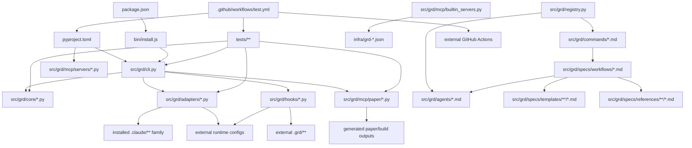

# Tests

This directory contains the automated test suite for GRD: core CLI and state regressions, runtime adapter coverage, hooks and MCP checks, release contracts, and fixture-based parity tests.

The final section of this README keeps the full checked-in repository interdependency graph that the graph guardrail tests read directly.

## Repository Interdependency Graph

<!-- repo-graph-generated-on:start -->
Generated on `2026-03-16` from the current worktree.
<!-- repo-graph-generated-on:end -->

## Status

This is the rebuilt root graph artifact for the repo. It is designed to be both the concrete dependency map and the root-level record of where absolute completeness is still not statically provable.

This graph therefore includes:

- canonical in-repo source edges
- installed and materialized artifact edges
- generated-output nodes used by build and test contracts
- external package, binary, service, and CI action nodes where they are operationally authoritative
- conditional and candidate-set edges where the code does not resolve to a single fixed file

## Scope

<!-- repo-graph-scope:start -->

- Live repo files analyzed in the current tree: `643`
- Python files under `src/` and `tests/`: `203`
- `src/grd/commands/*.md`: `61`
- `src/grd/agents/*.md`: `23`
- `src/grd/specs/workflows/*.md`: `62`
- `src/grd/specs/templates/**/*.md`: `71`
- `src/grd/specs/references/**/*.md`: `44`
- `src/grd/domains/**/*.md`: `112`
- `src/grd/adapters/*.py`: `9`
- `src/grd/hooks/*.py`: `6`
- `src/grd/mcp/servers/*.py`: `8`
- `tests/**` files: `135`
- `infra/grd-*.json`: `8`

Excluded as noise from node counting, but still modeled where contractually relevant:

- `.git/**`
- `.mcp.json`
- `.npm-cache/**`
- `__pycache__/**`
- `.venv/**`
- `.pytest_cache/**`
- `.mypy_cache/**`
- `.ruff_cache/**`
- `.grd/**`
- `.claude/**`
- `.gemini/**`
- `.codex/**`
- `.opencode/**`
- `dist/**`
<!-- repo-graph-scope:end -->

Generated-output families are modeled when code or tests depend on them:

- `dist/*.whl`
- `dist/*.tar.gz`
- `<workspace>/.grd/**`
- runtime config files and caches
- paper build outputs such as `main.pdf`, `ARTIFACT-MANIFEST.json`, `BIBLIOGRAPHY-AUDIT.json`

## Edge Taxonomy

| Edge Type | Meaning |
| --- | --- |
| `hard-import` | Normal Python import or direct module dependency |
| `package-data-load` | Runtime file loaded from package data, often via `importlib.resources` |
| `authority` | Canonical source-of-truth relation, such as packaging metadata or descriptor builder |
| `materialized` | Install-time copied or rewritten output |
| `partial-ownership` | File or tree is selectively managed, not wholly owned |
| `config-mutation` | Only specific config keys/sections are added, updated, or removed |
| `semantic` | Policy or behavioral dependency expressed in docs/config rather than code import form |
| `spawn` | One unit launches another unit or subprocess |
| `conditional-spawn` | Spawn active only under a branch, severity gate, optional mode, or detected gap |
| `include` | Explicit markdown include or prompt include |
| `conditional-include` | Include/reference active only under a branch, severity gate, or selector |
| `selector-input` | Config, state, flags, or mode classification that gates other edges |
| `candidate-set` | Ordered family of possible paths rather than one fixed path |
| `external-package` | Python package dependency |
| `external-binary` | System binary dependency |
| `external-service` | Network endpoint or remote authority |
| `generated-output` | Build/test/runtime generated artifact |
| `manifest-contract` | Test or runtime contract over manifest structure, hashes, or tracked cleanup |
| `negative-packaging-contract` | Contract that a file/dependency must be excluded from shipped artifacts |
| `count-contract` | Contract over counts, field cardinality, registry totals, or inventory shape |
| `ordering-contract` | Contract that depends on a specific ordering or precedence rule |
| `schema-contains` | Schema/model contains another schema/model as a typed field |
| `schema-canonicalizes` | Schema is used to normalize persisted data before writing |
| `schema-derived-constant` | Constants or field lists derived from schema structure |
| `entity-id-ref` | Object graph linked by IDs inside serialized data |
| `decorator-wrap` | Runtime behavior changed via decorator application |
| `span-context` | Runtime behavior instrumented through direct span context blocks |
| `golden-fixture-contract` | Tests depend on curated fixture corpora as canonical truth tables |
| `typed-roundtrip` | Tests or runtime paths validate typed serialize/deserialize normalization |
| `mention` | Weak text/path mention; low confidence compared with operational edges |

## High-Level Graph

## Canonical Authority Chains

- `package.json -> bin/install.js`
  `authority`
  npm/bootstrap surface; `bin/install.js` reads the npm wrapper version, the pinned Python package version, and repository metadata.

- `bin/install.js -> package.json`
  `package-data-load`

- `bin/install.js -> src/grd/adapters/runtime_catalog.json`
  `package-data-load`
  Bootstrap runtime selection and CLI help text are driven by the shared runtime catalog shipped in the npm tarball.

- `bin/install.js -> src/grd/cli.py`
  `spawn`
  The Node installer ultimately hands off to `python -m grd.cli {install,uninstall} ...`.

- `bin/install.js -> external Python package {get-research-done}`
  `external-package`

- `bin/install.js -> GitHub tagged release source family {https://github.com/psi-oss/get-research-done/archive/refs/tags/v<version>.tar.gz, git+https://github.com/psi-oss/get-research-done.git@v<version>}`
  `external-service`

- `bin/install.js -> GitHub main-branch source family {https://github.com/psi-oss/get-research-done/archive/refs/heads/main.tar.gz, git+https://github.com/psi-oss/get-research-done.git@main}`
  `external-service`

- `bin/install.js -> tagged release install candidate chain {tag archive, https tag checkout}`
  `ordering-contract`
  Normal install and `--reinstall` stay pinned to the matching tagged release and fail closed if it cannot be installed.

- `bin/install.js -> main-branch upgrade candidate chain {main archive, https main checkout}`
  `ordering-contract`
  `--upgrade` prefers the latest `main` branch source and fails closed if no main-branch source can be installed.

- `bin/install.js -> external binaries {node, python3, python, git}`
  `external-binary`

- `bin/install.js -> ${GRD_HOME:-~/.grd}/venv/**`
  `generated-output`

- `pyproject.toml -> src/grd/cli.py`
  `authority`
  Python console-script authority for `grd`.

- `pyproject.toml -> src/grd/mcp/servers/{conventions_server,verification_server,protocols_server,errors_mcp,patterns_server,state_server,skills_server}.py`
  `authority`
  Console-script authority for `grd-mcp-*` entrypoints.

- `src/grd/version.py -> pyproject.toml`
  `authority`
  Fallback version source when installed metadata is unavailable.

- `pyproject.toml -> external Python packages {typer, rich, pydantic, PyYAML, mcp[cli], pytest, pytest-asyncio, hatchling, pybtex, jinja2, Pillow, arxiv-mcp-server}`
  `external-package`

- `src/grd/mcp/builtin_servers.py -> infra/grd-*.json`
  `authority`
  Canonical descriptor builder for committed MCP descriptors.

- `README.md -> CONTRIBUTING.md`
  `authority`
  Public docs split between user-facing and contributor-facing flows.

## Root, Build, Release, and Governance Surface

- `README.md -> .github/workflows/test.yml`
  `mention`
  CI badge link only; weaker than execution or packaging edges.

- `.github/workflows/test.yml -> tests/**`
  `authority`
  Runs `uv run pytest tests/ -v` across the whole test tree.

- `.github/workflows/test.yml -> pyproject.toml`
  `authority`
  The workflow uses project dependency metadata via `uv sync --dev`.

- `.github/workflows/test.yml -> uv.lock`
  `authority`
  Locked dependency resolution surface for CI.

- `.github/workflows/test.yml -> actions/checkout@v4`
  `external-service`

- `.github/workflows/test.yml -> actions/setup-python@v5`
  `external-service`

- `.github/workflows/test.yml -> astral-sh/setup-uv@v4`
  `external-service`

- `.github/pull_request_template.md -> src/**`
  `partial-ownership`
  PR policy requires source changes to carry tests and docs implications.

- `.github/pull_request_template.md -> tests/**`
  `partial-ownership`

- `.github/pull_request_template.md -> README.md`
  `partial-ownership`

- `.github/ISSUE_TEMPLATE/bug_report.yml -> src/grd/cli.py`
  `semantic`
  Reporter is asked for `grd --version`.

- `.github/ISSUE_TEMPLATE/bug_report.yml -> pyproject.toml`
  `semantic`
  Public package metadata and version surface.

- `.github/ISSUE_TEMPLATE/bug_report.yml -> src/grd/version.py`
  `semantic`

- `.github/ISSUE_TEMPLATE/feature_request.yml -> src/grd/cli.py`
  `semantic`

- `.github/ISSUE_TEMPLATE/feature_request.yml -> src/grd/commands/**`
  `semantic`

- `CONTRIBUTING.md -> src/grd/mcp/builtin_servers.py`
  `authority`
  Contributor docs explicitly require keeping descriptors in sync with the canonical builder.

- `CONTRIBUTING.md -> infra/grd-*.json`
  `authority`

## CLI, Core Runtime, Schema, and Object Layers

- `src/grd/cli.py -> src/grd/core/*.py`
  `hard-import` plus `candidate-set`
  The CLI is a dynamic router over core modules and over on-disk project layout under `<cwd>/.grd/**`.

- `src/grd/cli.py -> external project-layout family <cwd>/.grd/{state.json,STATE.md,config.json,phases/**,milestones/**,traces/**}`
  `candidate-set`

- `src/grd/cli.py -> ordered paper-config candidate family {paper,manuscript,draft}/{PAPER-CONFIG.json,paper-config.json}`
  `candidate-set`

- `src/grd/cli.py -> ordered paper-config candidate family {paper,manuscript,draft}/{PAPER-CONFIG.json,paper-config.json}`
  `ordering-contract`
  `_resolve_existing_input_path()` returns the first existing config from the declared candidate order.

- `src/grd/cli.py -> candidate manuscript roots {paper/main.tex, manuscript/main.tex, draft/main.tex}`
  `candidate-set`

- `src/grd/cli.py -> candidate manuscript roots {paper/main.tex, manuscript/main.tex, draft/main.tex}`
  `ordering-contract`

- `src/grd/cli.py -> peer-review manuscript candidate family {target/main.tex, target/main.md, lexicographically first direct *.tex/*.md fallback}`
  `candidate-set`

- `src/grd/cli.py -> peer-review manuscript candidate family {target/main.tex, target/main.md, lexicographically first direct *.tex/*.md fallback}`
  `ordering-contract`

- `src/grd/cli.py -> bibliography candidate family {config_path.parent, output_dir, <cwd>/references}/{<bib_stem>.bib}`
  `candidate-set`

- `src/grd/cli.py -> bibliography candidate family {config_path.parent, output_dir, <cwd>/references}/{<bib_stem>.bib}`
  `ordering-contract`

- `src/grd/cli.py -> strict review artifact manifest candidates {manuscript.parent/ARTIFACT-MANIFEST.json, <cwd>/.grd/paper/ARTIFACT-MANIFEST.json}`
  `candidate-set`

- `src/grd/cli.py -> strict review artifact manifest candidates {manuscript.parent/ARTIFACT-MANIFEST.json, <cwd>/.grd/paper/ARTIFACT-MANIFEST.json}`
  `ordering-contract`

- `src/grd/cli.py -> strict review bibliography audit candidates {manuscript.parent/BIBLIOGRAPHY-AUDIT.json, <cwd>/.grd/paper/BIBLIOGRAPHY-AUDIT.json}`
  `candidate-set`

- `src/grd/cli.py -> strict review bibliography audit candidates {manuscript.parent/BIBLIOGRAPHY-AUDIT.json, <cwd>/.grd/paper/BIBLIOGRAPHY-AUDIT.json}`
  `ordering-contract`

- `src/grd/cli.py -> strict review reproducibility manifest candidates {manuscript.parent/reproducibility-manifest.json, manuscript.parent/REPRODUCIBILITY-MANIFEST.json, <cwd>/.grd/paper/reproducibility-manifest.json}`
  `candidate-set`

- `src/grd/cli.py -> strict review reproducibility manifest candidates {manuscript.parent/reproducibility-manifest.json, manuscript.parent/REPRODUCIBILITY-MANIFEST.json, <cwd>/.grd/paper/reproducibility-manifest.json}`
  `ordering-contract`

- `src/grd/cli.py -> src/grd/core/patterns.py -> {GRD_PATTERNS_ROOT, GRD_DATA_DIR, ~/.grd/learned-patterns}`
  `candidate-set`

- `src/grd/cli.py -> effective observability roots <cwd>/.grd/observability/{events.jsonl,sessions/*.jsonl,sessions/*.json,current-session.json}`
  `candidate-set`

- `src/grd/cli.py -> effective observability roots <cwd>/.grd/observability/{events.jsonl,sessions/*.jsonl,sessions/*.json,current-session.json}`
  `ordering-contract`
  `events.jsonl` is preferred before falling back to per-session event streams and session metadata.

- `src/grd/cli.py -> explicit --target-dir over adapter-derived local/global runtime roots during install/uninstall`
  `selector-input`
  Explicit target selection flips installed references from runtime-derived local/global paths to absolute target-root paths.

- `src/grd/cli.py -> src/grd/adapters/__init__.py`
  `hard-import`

- `src/grd/cli.py -> src/grd/mcp/paper/models.py`
  `hard-import`

- `src/grd/cli.py -> src/grd/mcp/paper/bibliography.py`
  `hard-import`

- `src/grd/cli.py -> src/grd/mcp/paper/compiler.py`
  `hard-import`

- `src/grd/core/state.py -> src/grd/contracts.py`
  `schema-contains`
  `ResearchState` contains `ConventionLock` and related typed state structures.

- `src/grd/core/state.py -> src/grd/core/results.py`
  `schema-contains`
  `ResearchState.intermediate_results` contains `IntermediateResult | str`.

- `src/grd/core/state.py -> state.json`
  `schema-canonicalizes`

- `src/grd/core/state.py -> STATE.md`
  `schema-canonicalizes`

- `src/grd/core/state.py -> state.json.bak`
  `generated-output`

- `src/grd/core/state.py -> <cwd>/.grd/state.intent`
  `generated-output`
  Dual-write recovery marker for interrupted `state.json` and `STATE.md` writes.

- `src/grd/core/results.py -> src/grd/contracts.py`
  `schema-contains`
  `IntermediateResult` uses `VerificationEvidence`.

- `src/grd/core/results.py -> src/grd/core/results.py::{IntermediateResult, MissingDep}`
  `schema-contains`
  `ResultDeps.result/direct_deps/transitive_deps` contain typed result/dependency records.

- `src/grd/core/results.py -> IntermediateResult.depends_on`
  `entity-id-ref`
  Internal result graph by ID, not by file path.

- `src/grd/core/state.py -> src/grd/core/results.py::IntermediateResult.id`
  `entity-id-ref`
  `state_validate()` resolves `depends_on[*]` as references to concrete result IDs.

- `src/grd/core/conventions.py -> src/grd/core/conventions.py::{ConventionEntry, ConventionDiff}`
  `schema-contains`
  Convention list/check/diff result models are nested typed structures, not flat dicts.

- `src/grd/mcp/paper/models.py -> BibliographyAudit -> ArtifactManifest -> ArtifactRecord -> ArtifactSourceRef`
  `schema-contains`

- `src/grd/mcp/paper/models.py -> src/grd/mcp/paper/models.py::{Author, Section, FigureRef, ArtifactManifest}`
  `schema-contains`

- `src/grd/mcp/paper/models.py -> src/grd/mcp/paper/bibliography.py::BibliographyAudit`
  `schema-contains`

- `src/grd/mcp/paper/models.py -> PaperOutput`
  `schema-canonicalizes`
  Paper-layer typed outputs normalize emitted manifest/audit structures.

- `src/grd/contracts.py -> src/grd/core/conventions.py`
  `schema-derived-constant`
  `ConventionLock.model_fields` drives known-convention lists and related counts.

- `src/grd/contracts.py -> src/grd/core/state.py`
  `schema-derived-constant`

- `src/grd/contracts.py -> tests/test_metadata_consistency.py`
  `count-contract`

- `src/grd/core/observability.py -> src/grd/core/*.py`
  `decorator-wrap`
  Runtime behavior changed through decorator application.

- `src/grd/core/observability.py -> src/grd/core/state.py`
  `decorator-wrap`

- `src/grd/core/observability.py -> src/grd/core/results.py`
  `decorator-wrap`

- `src/grd/core/observability.py -> src/grd/core/conventions.py`
  `decorator-wrap`

- `src/grd/core/observability.py -> src/grd/core/phases.py`
  `span-context`

- `src/grd/core/observability.py -> src/grd/core/health.py`
  `span-context`

- `src/grd/core/observability.py -> src/grd/adapters/*.py`
  `span-context`

- `src/grd/core/observability.py -> src/grd/mcp/servers/*.py`
  `span-context`

- `src/grd/core/observability.py -> <cwd>/.grd/observability/{events.jsonl,sessions/*.jsonl,sessions/*.json,current-session.json}`
  `generated-output`
  Observability writes and rereads the project-wide event stream, per-session event streams, and session metadata from this tree.

- `src/grd/core/context.py -> import-time platform snapshot _PLATFORM`
  `selector-input`
  `init_*` context helpers reuse a cached platform classification chosen at module import.

- `src/grd/core/context.py -> project scan envelope {lexicographic cwd walk, depth limit, capped hit count, excludes runtime config dirs and ignored trees}`
  `selector-input`
  New-project detection is gated by this scan envelope rather than by a raw recursive walk.

- `src/grd/core/query.py -> dependency frontmatter precedence {nested dependency-graph.{provides,requires,affects} over top-level counterparts}`
  `ordering-contract`
  Query-time dependency semantics follow parser precedence, not simple field union.

- `src/grd/core/query.py -> .grd/phases/**/{*-SUMMARY.md,SUMMARY.md}`
  `candidate-set`
  Query walks both plan-scoped `*-SUMMARY.md` files and standalone `SUMMARY.md` files under each phase directory.

## Registry, Commands, Agents, Workflows, Templates, and References

- `src/grd/registry.py -> src/grd/commands/*.md`
  `authority`
  Canonical parser for command prompt definitions.

- `src/grd/registry.py -> src/grd/agents/*.md`
  `authority`
  Canonical parser for agent prompt definitions.

<!-- repo-graph-same-stem-command-workflow:start -->
- `src/grd/commands/{add-phase,add-todo,arxiv-submission,audit-milestone,branch-hypothesis,check-todos,compact-state,compare-branches,compare-experiment,compare-results,complete-milestone,debug,decisions,derive-equation,dimensional-analysis,discover,discuss-phase,error-patterns,error-propagation,execute-phase,explain,export,graph,help,insert-phase,limiting-cases,list-phase-assumptions,literature-review,map-research,merge-phases,new-milestone,new-project,numerical-convergence,parameter-sweep,pause-work,peer-review,plan-milestone-gaps,plan-phase,progress,quick,reapply-patches,record-insight,regression-check,remove-phase,research-phase,respond-to-referees,resume-work,revise-phase,sensitivity-analysis,set-profile,settings,show-phase,slides,sync-state,undo,update,validate-conventions,verify-work,write-paper}.md -> src/grd/specs/workflows/{same stems}.md`
<!-- repo-graph-same-stem-command-workflow:end -->
  `include`
  Explicit same-stem command-to-workflow includes are node-level edges, not just an aggregate count.

- `src/grd/commands/explain.md -> src/grd/agents/{grd-explainer,grd-bibliographer}.md`
  `spawn`

- `src/grd/commands/literature-review.md -> src/grd/agents/grd-literature-reviewer.md`
  `spawn`

- `src/grd/commands/debug.md -> src/grd/agents/grd-debugger.md`
  `spawn`

- `src/grd/commands/map-research.md -> src/grd/agents/grd-research-mapper.md`
  `spawn`

- `src/grd/commands/plan-phase.md -> src/grd/agents/{grd-planner,grd-plan-checker}.md`
  `spawn`

- `src/grd/commands/quick.md -> src/grd/agents/{grd-planner,grd-executor}.md`
  `spawn`

- `src/grd/commands/research-phase.md -> src/grd/agents/grd-phase-researcher.md`
  `spawn`

- `src/grd/commands/write-paper.md -> src/grd/agents/{grd-paper-writer,grd-bibliographer,grd-review-reader,grd-review-literature,grd-review-math,grd-review-physics,grd-review-significance,grd-referee}.md`
  `spawn`

- `src/grd/commands/write-paper.md -> grd paper-build paper/PAPER-CONFIG.json`
  `spawn`

- `src/grd/commands/write-paper.md -> paper/{PAPER-CONFIG.json,main.tex,ARTIFACT-MANIFEST.json}`
  `generated-output`
  The command explicitly creates the paper config and requires the canonical manuscript scaffold before drafting continues.

- `src/grd/commands/peer-review.md -> src/grd/agents/{grd-review-reader,grd-review-literature,grd-review-math,grd-review-physics,grd-review-significance,grd-referee}.md`
  `spawn`

- `src/grd/commands/peer-review.md -> candidate manuscript roots {paper/main.tex, manuscript/main.tex, draft/main.tex}`
  `candidate-set`

- `src/grd/commands/health.md -> .grd/{STATE.md,state.json,config.json}`
  `include`

- `src/grd/commands/health.md -> grd --raw health {,--fix}`
  `spawn`

- `src/grd/commands/suggest-next.md -> .grd/{STATE.md,ROADMAP.md}`
  `include`

- `src/grd/commands/suggest-next.md -> grd --raw suggest`
  `spawn`

- `src/grd/commands/new-project.md -> src/grd/specs/workflows/new-project.md`
  `include`

- `src/grd/commands/new-project.md -> src/grd/specs/references/research/questioning.md`
  `include`

- `src/grd/commands/new-project.md -> src/grd/specs/references/ui/ui-brand.md`
  `include`

- `src/grd/commands/new-project.md -> src/grd/specs/templates/project.md`
  `include`

- `src/grd/commands/new-project.md -> src/grd/specs/templates/requirements.md`
  `include`

- `src/grd/commands/new-milestone.md -> src/grd/specs/workflows/new-milestone.md`
  `include`

- `src/grd/commands/new-milestone.md -> src/grd/specs/references/research/questioning.md`
  `include`

- `src/grd/commands/new-milestone.md -> src/grd/specs/references/ui/ui-brand.md`
  `include`

- `src/grd/commands/new-milestone.md -> src/grd/specs/templates/project.md`
  `include`

- `src/grd/commands/new-milestone.md -> src/grd/specs/templates/requirements.md`
  `include`

- `src/grd/commands/discuss-phase.md -> src/grd/specs/templates/context.md`
  `include`

- `src/grd/commands/complete-milestone.md -> src/grd/specs/templates/milestone-archive.md`
  `include`

- `src/grd/commands/execute-phase.md -> src/grd/specs/references/ui/ui-brand.md`
  `include`

- `src/grd/commands/plan-phase.md -> src/grd/specs/references/ui/ui-brand.md`
  `include`

- `src/grd/commands/research-phase.md -> src/grd/specs/references/orchestration/model-profile-resolution.md`
  `include`

- `src/grd/commands/verify-work.md -> src/grd/domains/physics/verification/core/verification-core.md`
  `include`

- `src/grd/specs/workflows/plan-phase.md -> src/grd/agents/grd-phase-researcher.md`
  `conditional-spawn`

- `src/grd/specs/workflows/plan-phase.md -> src/grd/agents/grd-planner.md`
  `spawn`

- `src/grd/specs/workflows/plan-phase.md -> src/grd/agents/grd-plan-checker.md`
  `conditional-spawn`

- `src/grd/specs/workflows/plan-phase.md -> src/grd/agents/grd-experiment-designer.md`
  `conditional-spawn`
  Only when numerical indicators or mode require it.

- `src/grd/specs/workflows/plan-phase.md -> src/grd/specs/templates/planner-subagent-prompt.md`
  `include`

- `src/grd/specs/workflows/plan-phase.md -> src/grd/specs/templates/phase-prompt.md`
  `include`

- `src/grd/specs/workflows/plan-phase.md -> src/grd/specs/references/ui/ui-brand.md`
  `include`

- `src/grd/specs/workflows/plan-phase.md -> src/grd/specs/references/orchestration/context-budget.md`
  `include`

- `src/grd/agents/grd-planner.md -> src/grd/specs/templates/planner-subagent-prompt.md`
  `include`

- `src/grd/agents/{grd-bibliographer,grd-consistency-checker,grd-debugger,grd-executor,grd-experiment-designer,grd-literature-reviewer,grd-notation-coordinator,grd-paper-writer,grd-phase-researcher,grd-plan-checker,grd-planner,grd-project-researcher,grd-referee,grd-research-synthesizer,grd-roadmapper,grd-research-mapper,grd-verifier}.md -> src/grd/specs/references/shared/shared-protocols.md`
  `include`

- `src/grd/agents/{grd-review-reader,grd-review-literature,grd-review-math,grd-review-physics,grd-review-significance}.md -> src/grd/specs/references/shared/shared-protocols.md`
  `include`

- `src/grd/agents/{grd-bibliographer,grd-consistency-checker,grd-debugger,grd-executor,grd-experiment-designer,grd-explainer,grd-literature-reviewer,grd-notation-coordinator,grd-paper-writer,grd-phase-researcher,grd-plan-checker,grd-planner,grd-project-researcher,grd-referee,grd-research-synthesizer,grd-roadmapper,grd-research-mapper}.md -> src/grd/specs/references/orchestration/agent-infrastructure.md`
  `include`

- `src/grd/agents/{grd-review-reader,grd-review-literature,grd-review-significance}.md -> src/grd/specs/references/orchestration/agent-infrastructure.md`
  `include`

- `src/grd/agents/{grd-bibliographer,grd-consistency-checker,grd-debugger,grd-executor,grd-explainer,grd-phase-researcher,grd-plan-checker,grd-planner,grd-referee,grd-research-mapper,grd-verifier}.md -> src/grd/domains/physics/physics-subfields.md`
  `include`

- `src/grd/agents/{grd-review-math,grd-review-physics}.md -> src/grd/domains/physics/physics-subfields.md`
  `include`

- `src/grd/agents/{grd-consistency-checker,grd-debugger,grd-plan-checker,grd-planner,grd-referee,grd-verifier}.md -> src/grd/domains/physics/verification/core/verification-core.md`
  `include`

- `src/grd/agents/{grd-review-math,grd-review-physics}.md -> src/grd/domains/physics/verification/core/verification-core.md`
  `include`

- `src/grd/agents/{grd-bibliographer,grd-paper-writer,grd-referee}.md -> src/grd/domains/physics/publication/publication-pipeline-modes.md`
  `include`

- `src/grd/agents/{grd-review-literature,grd-review-significance}.md -> src/grd/domains/physics/publication/publication-pipeline-modes.md`
  `include`

- `src/grd/agents/{grd-review-reader,grd-review-literature,grd-review-math,grd-review-physics,grd-review-significance,grd-referee}.md -> src/grd/domains/physics/publication/peer-review-panel.md`
  `include`

- `src/grd/agents/{grd-phase-researcher,grd-project-researcher,grd-verifier}.md -> src/grd/specs/references/research/research-modes.md`
  `include`

- `src/grd/agents/{grd-consistency-checker,grd-debugger,grd-executor}.md -> src/grd/specs/references/shared/cross-project-patterns.md`
  `include`

- `src/grd/agents/grd-bibliographer.md -> src/grd/specs/{templates/notation-glossary.md,references/publication/bibtex-standards.md}`
  `include`

- `src/grd/agents/grd-explainer.md -> src/grd/specs/templates/notation-glossary.md`
  `include`

- `src/grd/agents/grd-consistency-checker.md -> src/grd/specs/{references/examples/contradiction-resolution-example.md,references/verification/meta/verification-hierarchy-mapping.md,templates/uncertainty-budget.md,templates/conventions.md}`
  `include`

- `src/grd/agents/grd-debugger.md -> src/grd/specs/workflows/record-insight.md`
  `include`

- `src/grd/agents/grd-experiment-designer.md -> src/grd/specs/references/examples/ising-experiment-design-example.md`
  `include`

- `src/grd/agents/grd-notation-coordinator.md -> src/grd/specs/{references/conventions/subfield-convention-defaults.md,templates/conventions.md}`
  `include`

- `src/grd/agents/grd-paper-writer.md -> src/grd/specs/{templates/notation-glossary.md,templates/latex-preamble.md,references/publication/figure-generation-templates.md}`
  `include`

- `src/grd/agents/grd-planner.md -> src/grd/specs/{templates/phase-prompt.md,templates/parameter-table.md,templates/summary.md,workflows/execute-plan.md,references/protocols/order-of-limits.md,references/methods/approximation-selection.md,references/verification/core/code-testing-physics.md,references/orchestration/checkpoints.md,references/planning/planner-conventions.md,references/planning/planner-approximations.md,references/planning/planner-scope-examples.md,references/planning/planner-tdd.md,references/planning/planner-iterative.md,references/protocols/hypothesis-driven-research.md}`
  `include`

- `src/grd/agents/grd-executor.md -> src/grd/specs/{references/tooling/tool-integration.md,references/execution/executor-index.md,references/execution/executor-subfield-guide.md,references/execution/executor-deviation-rules.md,references/execution/executor-verification-flows.md,references/execution/executor-task-checkpoints.md,references/execution/executor-completion.md,references/execution/executor-worked-example.md,references/protocols/order-of-limits.md,references/methods/approximation-selection.md,references/verification/errors/llm-physics-errors.md,references/verification/core/code-testing-physics.md,references/orchestration/checkpoints.md,templates/state-machine.md,templates/summary.md,templates/calculation-log.md}`
  `include`

- `src/grd/agents/grd-research-synthesizer.md -> src/grd/specs/templates/research-project/SUMMARY.md`
  `include`

- `src/grd/agents/grd-roadmapper.md -> src/grd/specs/templates/{roadmap.md,state.md}`
  `include`

- `src/grd/agents/grd-roadmapper.md -> src/grd/specs/templates/project-types/{qft-calculation,algebraic-qft,conformal-bootstrap,string-field-theory,stat-mech-simulation}.md`
  `conditional-include`
  Selector family with explicit statically named candidates.

- `src/grd/agents/grd-verifier.md -> src/grd/specs/{references/verification/meta/verification-hierarchy-mapping.md,references/verification/core/computational-verification-templates.md,references/verification/domains/verification-domain-{qft,condmat,statmech,gr-cosmology,amo,nuclear-particle,astrophysics,fluid-plasma,mathematical-physics,algebraic-qft,string-field-theory,quantum-info,soft-matter}.md}`
  `conditional-include`

- `.grd/config.json::{autonomy,research_mode,workflow.research,workflow.plan_checker,workflow.verifier,workflow.verify_between_waves,model_profile} -> src/grd/specs/workflows/{plan-phase,execute-phase,verify-work,new-project,write-paper}.md`
  `selector-input`

- `STATE.md/state.json::convention_lock -> src/grd/specs/workflows/{execute-phase,validate-conventions,new-project}.md`
  `selector-input`
  Convention-lock state participates in selector-driven orchestration and validation gates.

- `src/grd/specs/workflows/execute-phase.md -> src/grd/specs/workflows/execute-plan.md`
  `include`

- `src/grd/specs/workflows/execute-phase.md -> src/grd/specs/workflows/verify-phase.md`
  `include`

- `src/grd/specs/workflows/execute-phase.md -> src/grd/specs/workflows/transition.md`
  `include`

- `src/grd/specs/workflows/execute-phase.md -> src/grd/agents/grd-executor.md`
  `spawn`

- `src/grd/specs/workflows/execute-phase.md -> src/grd/agents/grd-debugger.md`
  `conditional-spawn`

- `src/grd/specs/workflows/execute-phase.md -> src/grd/agents/grd-verifier.md`
  `conditional-spawn`

- `src/grd/specs/workflows/execute-phase.md -> src/grd/agents/grd-consistency-checker.md`
  `conditional-spawn`

- `src/grd/specs/workflows/execute-phase.md -> src/grd/agents/grd-notation-coordinator.md`
  `conditional-spawn`

- `src/grd/specs/workflows/execute-phase.md -> src/grd/agents/grd-experiment-designer.md`
  `conditional-spawn`

- `src/grd/specs/workflows/execute-phase.md -> selector tree {phase classification, force-sequential, YOLO restrictions, inter-wave verification gates}`
  `selector-input`

- `src/grd/specs/workflows/execute-phase.md -> src/grd/specs/{references/orchestration/meta-orchestration.md,references/orchestration/checkpoints.md,references/verification/core/verification-core.md,templates/summary.md,templates/continuation-prompt.md,templates/paper/figure-tracker.md,templates/paper/experimental-comparison.md,templates/recovery-plan.md}`
  `include`

- `src/grd/specs/workflows/execute-plan.md -> src/grd/domains/physics/protocols/error-propagation-protocol.md`
  `include`

- `src/grd/specs/workflows/execute-plan.md -> src/grd/specs/{references/execution/git-integration.md,references/execution/execute-plan-recovery.md,references/execution/execute-plan-validation.md,references/execution/execute-plan-checkpoints.md,references/protocols/reproducibility.md,references/execution/executor-index.md,references/orchestration/context-budget.md,references/orchestration/checkpoints.md,templates/summary.md}`
  `include`

- `src/grd/specs/workflows/execute-plan.md -> src/grd/specs/templates/calculation-log.md`
  `include`

- `src/grd/specs/workflows/execute-plan.md -> src/grd/specs/templates/recovery-plan.md`
  `include`

- `src/grd/specs/workflows/verify-phase.md -> src/grd/domains/physics/protocols/error-propagation-protocol.md`
  `include`

- `src/grd/specs/workflows/verify-phase.md -> src/grd/specs/{references/verification/core/verification-core.md,references/verification/core/verification-numerical.md,references/verification/meta/verification-independence.md,templates/verification-report.md,workflows/numerical-convergence.md}`
  `include`

- `src/grd/specs/workflows/verify-work.md -> src/grd/specs/templates/research-verification.md`
  `include`

- `src/grd/specs/workflows/verify-work.md -> src/grd/domains/physics/protocols/error-propagation-protocol.md`
  `include`

- `src/grd/specs/workflows/verify-work.md -> src/grd/specs/{references/verification/meta/verification-independence.md,workflows/debug.md}`
  `include`

- `src/grd/specs/workflows/verify-work.md -> src/grd/agents/grd-planner.md`
  `conditional-spawn`
  Gap-closure branch, not unconditional base flow.

- `src/grd/specs/workflows/verify-work.md -> src/grd/agents/grd-plan-checker.md`
  `conditional-spawn`

- `src/grd/specs/workflows/error-propagation.md -> src/grd/domains/physics/protocols/error-propagation-protocol.md`
  `include`

- `src/grd/specs/workflows/error-propagation.md -> src/grd/specs/templates/uncertainty-budget.md`
  `include`

- `src/grd/specs/workflows/error-propagation.md -> src/grd/specs/templates/parameter-table.md`
  `include`

- `src/grd/specs/workflows/write-paper.md -> src/grd/agents/grd-paper-writer.md`
  `spawn`

- `src/grd/specs/workflows/write-paper.md -> src/grd/agents/grd-bibliographer.md`
  `spawn`

- `src/grd/specs/workflows/write-paper.md -> src/grd/agents/{grd-review-reader,grd-review-literature,grd-review-math,grd-review-physics,grd-review-significance,grd-referee}.md`
  `spawn`

- `src/grd/specs/workflows/write-paper.md -> src/grd/specs/workflows/peer-review.md`
  `include`

- `src/grd/specs/workflows/write-paper.md -> src/grd/cli.py::paper_build`
  `spawn`
  Invoked as `grd paper-build paper/PAPER-CONFIG.json` before section drafting and review.

- `src/grd/specs/workflows/write-paper.md -> paper/{PAPER-CONFIG.json,main.tex,ARTIFACT-MANIFEST.json}`
  `generated-output`
  Drafting and downstream review are gated on the scaffold and manifest emitted by the paper-build contract.

- `src/grd/specs/workflows/write-paper.md -> src/grd/agents/grd-referee.md`
  `spawn`

- `src/grd/specs/workflows/peer-review.md -> src/grd/agents/{grd-review-reader,grd-review-literature,grd-review-math,grd-review-physics,grd-review-significance,grd-referee}.md`
  `spawn`

- `src/grd/specs/workflows/peer-review.md -> candidate manuscript roots {paper/main.tex, manuscript/main.tex, draft/main.tex}`
  `candidate-set`

- `src/grd/specs/workflows/peer-review.md -> paper/{PAPER-CONFIG.json,ARTIFACT-MANIFEST.json,BIBLIOGRAPHY-AUDIT.json}`
  `conditional-include`
  `PAPER-CONFIG.json` is optional journal context; in strict review mode the manifest and bibliography audit become fail-closed inputs.

- `src/grd/specs/workflows/write-paper.md -> selector set {mode, existing manuscript/artifact checks, approval and hard-gate branches}`
  `selector-input`

- `src/grd/specs/workflows/write-paper.md -> src/grd/specs/{references/publication/publication-pipeline-modes.md,references/publication/paper-quality-scoring.md,templates/latex-preamble.md,templates/paper/supplemental-material.md,templates/paper/experimental-comparison.md}`
  `include`

- `src/grd/specs/workflows/debug.md -> src/grd/specs/templates/debug-subagent-prompt.md`
  `conditional-include`
  One per detected gap.

- `src/grd/specs/workflows/debug.md -> src/grd/agents/grd-debugger.md`
  `conditional-spawn`

- `src/grd/specs/workflows/audit-milestone.md -> src/grd/agents/grd-consistency-checker.md`
  `spawn`

- `src/grd/specs/workflows/audit-milestone.md -> src/grd/agents/grd-referee.md`
  `conditional-spawn`
  Only when config/user request enables referee review.

- `src/grd/specs/workflows/validate-conventions.md -> src/grd/agents/grd-notation-coordinator.md`
  `conditional-spawn`
  Severity-gated by critical convention conflicts.

- `src/grd/specs/workflows/validate-conventions.md -> src/grd/agents/grd-consistency-checker.md`
  `spawn`

- `src/grd/specs/workflows/quick.md -> src/grd/agents/grd-planner.md`
  `spawn`

- `src/grd/specs/workflows/quick.md -> src/grd/agents/grd-executor.md`
  `spawn`

- `src/grd/specs/workflows/new-project.md -> src/grd/specs/templates/project.md`
  `include`

- `src/grd/specs/workflows/new-project.md -> src/grd/specs/{references/research/questioning.md,references/conventions/subfield-convention-defaults.md}`
  `include`

- `src/grd/specs/workflows/new-project.md -> src/grd/specs/templates/research-project/PRIOR-WORK.md`
  `include`

- `src/grd/specs/workflows/new-project.md -> src/grd/specs/templates/research-project/METHODS.md`
  `include`

- `src/grd/specs/workflows/new-project.md -> src/grd/specs/templates/research-project/COMPUTATIONAL.md`
  `include`

- `src/grd/specs/workflows/new-project.md -> src/grd/specs/templates/research-project/PITFALLS.md`
  `include`

- `src/grd/specs/workflows/new-project.md -> src/grd/specs/templates/research-project/SUMMARY.md`
  `include`

- `src/grd/specs/workflows/new-project.md -> src/grd/agents/{grd-project-researcher,grd-research-synthesizer,grd-roadmapper}.md`
  `conditional-spawn`

- `src/grd/specs/workflows/new-project.md -> src/grd/agents/grd-notation-coordinator.md`
  `conditional-spawn`

- `src/grd/specs/workflows/new-project.md -> selector set {major mode, approval gates, existing file checks}`
  `selector-input`

- `src/grd/specs/workflows/new-milestone.md -> src/grd/specs/templates/research-project/SUMMARY.md`
  `include`

- `src/grd/specs/workflows/new-milestone.md -> src/grd/agents/{grd-project-researcher,grd-research-synthesizer,grd-roadmapper}.md`
  `conditional-spawn`

- `src/grd/specs/workflows/new-milestone.md -> selector set {major mode, approval gates, existing file checks}`
  `selector-input`

- `src/grd/specs/workflows/map-research.md -> src/grd/agents/grd-research-mapper.md`
  `spawn`

- `src/grd/specs/workflows/explain.md -> src/grd/agents/{grd-explainer,grd-bibliographer}.md`
  `spawn`

- `src/grd/specs/workflows/literature-review.md -> src/grd/agents/grd-bibliographer.md`
  `spawn`

- `src/grd/specs/workflows/parameter-sweep.md -> src/grd/specs/{workflows/execute-plan.md,templates/summary.md}`
  `include`

- `src/grd/specs/workflows/parameter-sweep.md -> src/grd/agents/grd-executor.md`
  `spawn`

- `src/grd/specs/workflows/respond-to-referees.md -> src/grd/agents/grd-paper-writer.md`
  `spawn`

- `src/grd/specs/workflows/research-phase.md -> src/grd/specs/references/orchestration/model-profile-resolution.md`
  `include`

- `src/grd/specs/workflows/research-phase.md -> src/grd/agents/grd-phase-researcher.md`
  `spawn`

- `src/grd/specs/workflows/{arxiv-submission,compact-state,compare-experiment,discover,insert-phase,resume-work,sensitivity-analysis,sync-state}.md -> src/grd/specs/{references/publication/paper-quality-scoring.md,templates/state-archive.md,templates/paper/experimental-comparison.md,templates/research.md,references/orchestration/agent-infrastructure.md,references/orchestration/continuation-format.md,templates/parameter-table.md,templates/state-json-schema.md}`
  `include`

- `src/grd/specs/templates/continuation-prompt.md -> src/grd/specs/{workflows/execute-plan.md,templates/summary.md,references/orchestration/checkpoints.md,references/verification/core/verification-core.md}`
  `include`

- `src/grd/specs/templates/phase-prompt.md -> src/grd/specs/{workflows/execute-plan.md,templates/summary.md}`
  `include`

- `src/grd/specs/templates/planner-subagent-prompt.md -> src/grd/specs/references/orchestration/context-budget.md`
  `include`

- `src/grd/specs/templates/learned-pattern.md -> src/grd/specs/references/shared/cross-project-patterns.md`
  `include`

- `src/grd/specs/references/execution/execute-plan-recovery.md -> src/grd/specs/templates/recovery-plan.md`
  `include`

- `src/grd/agents/grd-research-mapper.md -> src/grd/specs/references/templates/research-mapper/{FORMALISM,REFERENCES,ARCHITECTURE,STRUCTURE,CONVENTIONS,VALIDATION,CONCERNS}.md`
  `include`

## Adapters, Manifests, Installed Artifacts, and Selective Ownership

- `src/grd/adapters/base.py -> src/grd/adapters/install_utils.py`
  `hard-import`

- `src/grd/adapters/runtime_catalog.py -> src/grd/adapters/runtime_catalog.json`
  `package-data-load`
  The adapter layer loads its shared runtime descriptor catalog from package data.

- `src/grd/adapters/base.py -> src/grd/adapters/install_utils.py::pre_install_cleanup`
  `spawn`

- `src/grd/adapters/install_utils.py::pre_install_cleanup -> save_local_patches() -> grd-file-manifest.json["files"] -> grd-local-patches/**`
  `manifest-contract`
  The manifest is a control-plane node and selective-backup baseline, not just inventory.

- `src/grd/adapters/install_utils.py -> .claude/commands/grd/**`
  `materialized`

- `src/grd/adapters/install_utils.py -> .claude/agents/**`
  `materialized`

- `src/grd/adapters/install_utils.py -> .claude/get-research-done/**`
  `materialized`

- `src/grd/adapters/install_utils.py -> .claude/hooks/**`
  `materialized`

- `src/grd/adapters/{base.py,install_utils.py,opencode.py} -> runtime target_dir/hooks/**`
  `materialized`
  Claude, Gemini, Codex, and OpenCode all copy the bundled hook files into `target_dir/hooks/`, even though only some runtimes wire those hooks to live entrypoints.

- `src/grd/adapters/install_utils.py -> .claude/get-research-done/VERSION`
  `materialized`

- `src/grd/adapters/install_utils.py -> .claude/grd-file-manifest.json`
  `materialized`

- `src/grd/hooks/{check_update,statusline,notify,runtime_detect}.py -> .claude/hooks/{check_update,statusline,notify,runtime_detect}.py`
  `materialized`

- `src/grd/hooks/{check_update,statusline,notify,runtime_detect}.py -> runtime target_dir/hooks/{check_update,statusline,notify,runtime_detect}.py`
  `materialized`

- `src/grd/cli.py::_install_single_runtime -> adapter.install()`
  `spawn`

- `src/grd/cli.py::_install_single_runtime -> src/grd/adapters/install_utils.py::compute_path_prefix`
  `spawn`

- `src/grd/cli.py::_install_single_runtime -> adapter.finalize_install() -> src/grd/adapters/install_utils.py::finish_install()`
  `spawn`
  Final config persistence happens here for Claude and Gemini.

- `src/grd/adapters/install_utils.py::ensure_update_hook -> settings.json["hooks"]["SessionStart"]`
  `config-mutation`

- `src/grd/adapters/install_utils.py::ensure_update_hook -> existing non-GRD SessionStart hook entries`
  `partial-ownership`

- `src/grd/adapters/install_utils.py::finish_install -> settings.json["statusLine"]`
  `config-mutation`

- `src/grd/adapters/install_utils.py::finish_install -> preexisting non-GRD statusLine command`
  `partial-ownership`

- `src/grd/adapters/claude_code.py -> .claude/settings.json`
  `config-mutation`

- `src/grd/adapters/claude_code.py -> target_dir.parent/{.mcp.json,.claude.json}["mcpServers"]`
  `config-mutation`
  Claude MCP wiring stays scoped to the selected install target root; local installs mutate the paired project `.mcp.json`, global installs mutate the paired `.claude.json`.

- `src/grd/adapters/claude_code.py -> target_dir.parent/{.mcp.json,.claude.json}["mcpServers"][GRD_MCP_SERVER_KEYS]`
  `partial-ownership`

- `src/grd/adapters/gemini.py -> settings.json["experimental.enableAgents"]`
  `config-mutation`

- `src/grd/adapters/gemini.py -> settings.json["mcpServers"]`
  `config-mutation`

- `src/grd/adapters/gemini.py -> settings.json["mcpServers"][GRD_MCP_SERVER_KEYS]`
  `partial-ownership`

- `src/grd/adapters/gemini.py -> settings.json["statusLine"]`
  `config-mutation`

- `src/grd/adapters/codex.py -> config.toml`
  `config-mutation`

- `src/grd/adapters/codex.py -> config.toml[mcp_servers.grd-*]`
  `config-mutation`

- `src/grd/adapters/codex.py -> non-GRD [mcp_servers.*] sections`
  `partial-ownership`

- `src/grd/adapters/codex.py -> config.toml::notify`
  `config-mutation`

- `src/grd/adapters/codex.py -> config.toml[features].multi_agent`
  `config-mutation`

- `src/grd/adapters/codex.py -> ~/.agents/skills`
  `partial-ownership`
  Discoverable Codex command skills live here; agent roles stay under `.codex/agents/`.

- `src/grd/adapters/codex.py -> grd-file-manifest.json::codex_skills_dir`
  `manifest-contract`
  Used later by uninstall to locate shared skills.

- `src/grd/adapters/install_utils.py::write_manifest -> grd-file-manifest.json["files"]["skills/grd-*/SKILL.md"]`
  `manifest-contract`

- `src/grd/adapters/opencode.py -> opencode.json`
  `config-mutation`

- `src/grd/adapters/opencode.py -> opencode.json["mcp"]`
  `config-mutation`

- `src/grd/adapters/opencode.py -> opencode.json["mcp"] keys from GRD_MCP_SERVER_KEYS`
  `partial-ownership`

- `src/grd/adapters/opencode.py -> permission.read["<configDir>/get-research-done/*"]`
  `partial-ownership`

- `src/grd/adapters/opencode.py -> permission.external_directory["<configDir>/get-research-done/*"]`
  `partial-ownership`

- `src/grd/adapters/base.py -> HOOK_SCRIPTS.values()`
  `partial-ownership`
  Uninstall removes only bundled GRD hook filenames, not arbitrary user hooks.

- `src/grd/adapters/install_utils.py -> split ownership {manifest-backed content vs separately managed runtime config and bundled hooks}`
  `partial-ownership`
  Backup/reapply semantics are manifest-driven, while hook and runtime-config cleanup follow separate managed-path rules.

- `src/grd/adapters/opencode.py::write_manifest -> grd-file-manifest.json["files"]["command/grd-*.md"]`
  `manifest-contract`

- `.claude/settings.json`
  `generated-output`
  Runtime-local Claude config artifact emitted by local installs; not a canonical repo file.

### Selective Ownership Statement

Adapters do not own an entire runtime tree. They own only:

- `commands/grd/**`
- `agents/grd-*` or GRD-managed skills
- `get-research-done/**`
- bundled hook filenames
- `VERSION`
- `grd-file-manifest.json`
- `grd-local-patches/**`
- specific config keys or sections

They explicitly preserve:

- non-GRD commands
- non-GRD agents
- unrelated hook files
- unrelated config keys
- unrelated OpenCode permission entries

## Hooks, Runtime Detection, Caches, and External Authorities

- `src/grd/hooks/runtime_detect.py -> src/grd/adapters/__init__.py`
  `authority`
  Adapter metadata source of truth for runtime names, iteration order, and config-dir resolution.

- `src/grd/hooks/runtime_detect.py -> src/grd/adapters/install_utils.py`
  `hard-import`

- `src/grd/hooks/runtime_detect.py -> src/grd/adapters/base.py`
  `authority`

- `src/grd/hooks/runtime_detect.py -> src/grd/adapters/{claude_code,codex,gemini,opencode}.py`
  `authority`

- `src/grd/hooks/runtime_detect.py -> environment signals {CLAUDE_CODE_SESSION, CLAUDE_CODE, CODEX_SESSION, CODEX_CLI, GEMINI_CLI, OPENCODE_SESSION, CLAUDE_CONFIG_DIR, CODEX_CONFIG_DIR, GEMINI_CONFIG_DIR, OPENCODE_CONFIG_DIR, OPENCODE_CONFIG, XDG_CONFIG_HOME}`
  `candidate-set`

- `src/grd/hooks/runtime_detect.py -> active runtime precedence {activation env vars -> local runtime dirs -> global runtime dirs -> ALL_RUNTIMES tie-break}`
  `ordering-contract`
  Runtime detection is precedence-driven, not a flat unordered candidate family.

- `src/grd/hooks/runtime_detect.py -> candidate runtime directories {cwd}/{.claude,.codex,.gemini,.opencode} and global {home}/{.claude,.codex,.gemini,.config/opencode}`
  `candidate-set`

- `src/grd/hooks/runtime_detect.py -> detect_install_scope() prefers local runtime dirs over global dirs when both exist`
  `ordering-contract`

- `src/grd/hooks/runtime_detect.py -> active-first candidate families for {VERSION, update caches} under detected runtime local/global dirs before ~/.grd fallback`
  `ordering-contract`
  Hook consumers inherit this precedence through `get_grd_install_dirs(prefer_active=True)` and `get_update_cache_files()`.

- `tests/hooks/test_runtime_detect.py -> src/grd/hooks/runtime_detect.py::ALL_RUNTIMES`
  `ordering-contract`

- `src/grd/hooks/statusline.py -> <workspace>/.grd/state.json`
  `candidate-set`

- `src/grd/hooks/statusline.py -> src/grd/hooks/runtime_detect.py`
  `hard-import`

- `src/grd/hooks/statusline.py -> freshest valid update-cache candidate from runtime_detect.get_update_cache_files()`
  `candidate-set`

- `src/grd/hooks/statusline.py -> candidate todo family {local,global runtime dirs}/todos/<session>-agent-*.json`
  `candidate-set`

- `src/grd/hooks/statusline.py -> stdin payload schema {model, workspace, session_id, context_window}`
  `candidate-set`

- `src/grd/hooks/statusline.py -> src/grd/adapters/__init__.py`
  `hard-import`
  Uses adapter-formatted update commands for runtime UI output when the active runtime is known.

- `src/grd/hooks/check_update.py -> src/grd/version.py`
  `hard-import`

- `src/grd/hooks/check_update.py -> src/grd/hooks/runtime_detect.py`
  `hard-import`

- `src/grd/hooks/check_update.py -> VERSION candidate family under runtime install dirs`
  `candidate-set`

- `src/grd/hooks/check_update.py -> VERSION candidate family under runtime install dirs`
  `ordering-contract`

- `src/grd/hooks/check_update.py -> update-cache candidate family including ~/.grd/cache/grd-update-check.json`
  `candidate-set`

- `src/grd/hooks/check_update.py -> update-cache candidate family including ~/.grd/cache/grd-update-check.json`
  `ordering-contract`

- `src/grd/hooks/check_update.py -> https://registry.npmjs.org/get-research-done/latest`
  `external-service`
  Latest-version authority.

- `src/grd/hooks/notify.py -> src/grd/hooks/check_update.py`
  `spawn`

- `src/grd/hooks/notify.py -> freshest valid update-cache candidate set`
  `candidate-set`

- `src/grd/hooks/notify.py -> stdin payload schema {type, workspace}`
  `candidate-set`

- `src/grd/hooks/notify.py -> src/grd/hooks/runtime_detect.py`
  `hard-import`
  Reads cache candidates and runtime-scoped update commands through runtime-detection helpers.

- `src/grd/core/context.py -> src/grd/adapters/__init__.py`
  `authority`
  Adapter iteration determines the runtime config directories excluded from project scans.

## MCP Servers, Paper Pipeline, Package Data, and External Packages

- `src/grd/mcp/builtin_servers.py -> infra/grd-{conventions,errors,patterns,protocols,skills,state,verification,arxiv}.json`
  `authority`

- `src/grd/mcp/builtin_servers.py -> external binary {python}`
  `external-binary`

- `src/grd/mcp/builtin_servers.py -> external Python package {arxiv_mcp_server}`
  `external-package`

- `infra/grd-{conventions,errors,patterns,protocols,skills,state,verification,arxiv}.json -> external binary {python}`
  `external-binary`

- `infra/grd-arxiv.json -> external Python package {arxiv_mcp_server}`
  `external-package`

- `src/grd/mcp/servers/state_server.py -> src/grd/core/{config,health,state,errors}.py`
  `hard-import`

- `src/grd/mcp/servers/state_server.py -> src/grd/core/observability.py`
  `hard-import`

- `tests/mcp/test_servers.py -> src/grd/mcp/servers/{conventions_server,errors_mcp,patterns_server,protocols_server,skills_server,state_server,verification_server}.py`
  `hard-import`

- `src/grd/mcp/paper/__init__.py -> src/grd/mcp/paper/{bibliography,compiler,journal_map,models,review_artifacts}.py`
  `hard-import`

- `src/grd/mcp/paper/template_registry.py -> src/grd/mcp/paper/templates/**`
  `package-data-load`

- `src/grd/mcp/paper/template_registry.py -> src/grd/mcp/paper/models.py`
  `hard-import`

- `src/grd/mcp/paper/template_registry.py -> src/grd/utils/latex.py`
  `hard-import`

- `src/grd/mcp/paper/template_registry.py -> external Python package {jinja2}`
  `external-package`

- `src/grd/mcp/paper/models.py -> external Python package {pydantic}`
  `external-package`

- `src/grd/mcp/paper/journal_map.py -> src/grd/mcp/paper/models.py::JournalSpec`
  `hard-import`

- `src/grd/mcp/paper/bibliography.py -> external Python packages {arxiv, pybtex, pydantic}`
  `external-package`

- `src/grd/mcp/paper/artifact_manifest.py -> src/grd/mcp/paper/bibliography.py::BibliographyAudit`
  `hard-import`

- `src/grd/mcp/paper/artifact_manifest.py -> src/grd/mcp/paper/models.py::{ArtifactManifest, ArtifactRecord, ArtifactSourceRef, FigureRef, PaperConfig}`
  `hard-import`

- `src/grd/mcp/paper/figures.py -> src/grd/mcp/paper/journal_map.py`
  `hard-import`

- `src/grd/mcp/paper/figures.py -> src/grd/mcp/paper/models.py::FigureRef`
  `hard-import`

- `src/grd/mcp/paper/figures.py -> external Python packages {Pillow, cairosvg}`
  `external-package`

- `src/grd/mcp/paper/figures.py -> inkscape`
  `external-binary`

- `src/grd/mcp/paper/figures.py -> generated outputs {normalized/copied figure files under output_dir}`
  `generated-output`

- `src/grd/mcp/paper/figures.py -> cairosvg`
  `conditional-include`
  Optional converter path; not always exercised.

- `src/grd/mcp/paper/figures.py -> epstopdf`
  `conditional-include`
  Downstream conversion path; weaker than the hard binary/compiler edges.

- `src/grd/mcp/paper/compiler.py -> kpsewhich`
  `external-binary`

- `src/grd/mcp/paper/compiler.py -> latexmk`
  `external-binary`

- `src/grd/mcp/paper/compiler.py -> pdflatex`
  `external-binary`

- `src/grd/mcp/paper/compiler.py -> xelatex`
  `external-binary`

- `src/grd/mcp/paper/compiler.py -> bibtex`
  `external-binary`

- `src/grd/mcp/paper/compiler.py -> src/grd/mcp/paper/{artifact_manifest,bibliography,figures,journal_map,models,template_registry}.py`
  `hard-import`

- `src/grd/mcp/paper/compiler.py -> external Python package {pybtex}`
  `external-package`

- `src/grd/mcp/paper/review_artifacts.py -> external Python package {pydantic}`
  `external-package`

- `src/grd/mcp/paper/review_artifacts.py -> src/grd/mcp/paper/models.py::{ClaimIndex, StageReviewReport, ReviewLedger, ReviewPanelBundle}`
  `hard-import`

- `src/grd/mcp/paper/bibliography.py -> generated outputs {*.bib, BIBLIOGRAPHY-AUDIT.json}`
  `generated-output`

- `src/grd/mcp/paper/artifact_manifest.py -> ARTIFACT-MANIFEST.json`
  `generated-output`

- `src/grd/mcp/paper/review_artifacts.py -> generated outputs {CLAIMS.json, STAGE-*.json, REVIEW-LEDGER.json, PANEL-BUNDLE.json}`
  `generated-output`

- `src/grd/mcp/paper/compiler.py -> generated outputs {figures/**, main.tex, <bib>.bib, BIBLIOGRAPHY-AUDIT.json, ARTIFACT-MANIFEST.json, main.pdf}`
  `generated-output`

- `tests/test_paper_e2e.py -> src/grd/mcp/paper/compiler.py`
  `hard-import`

- `tests/test_paper_e2e.py -> src/grd/mcp/paper/template_registry.py`
  `hard-import`

- `tests/test_paper_e2e.py -> src/grd/mcp/paper/artifact_manifest.py`
  `hard-import`

- `tests/test_paper_e2e.py -> src/grd/mcp/paper/bibliography.py`
  `hard-import`

- `tests/test_paper_e2e.py -> generated outputs {main.tex, references.bib, ARTIFACT-MANIFEST.json, BIBLIOGRAPHY-AUDIT.json, main.pdf, figures/**}`
  `generated-output`

- `tests/test_paper_models.py -> src/grd/mcp/paper/{models,journal_map,template_registry}.py`
  `hard-import`

- `tests/test_bibliography.py -> src/grd/mcp/paper/bibliography.py`
  `hard-import`

- `tests/test_bibliography.py -> external Python packages {arxiv, pybtex}`
  `external-package`

- `tests/test_bibliography.py -> generated outputs {refs.bib, bibliography-audit.json}`
  `generated-output`

- `tests/test_figures.py -> src/grd/mcp/paper/figures.py`
  `hard-import`

- `tests/test_figures.py -> inkscape`
  `external-binary`

- `tests/test_figures.py -> external Python packages {Pillow, cairosvg}`
  `conditional-include`
  Much of the test surface validates fallback/error behavior rather than proving live converter availability.

- `tests/core/test_review_artifacts.py -> src/grd/mcp/paper/review_artifacts.py`
  `hard-import`

- `tests/core/test_review_artifacts.py -> generated outputs {CLAIMS.json, STAGE-*.json, REVIEW-LEDGER.json, PANEL-BUNDLE.json}`
  `typed-roundtrip`

- `tests/test_paper_compiler_regressions.py -> external binaries {latexmk, pdflatex}`
  `external-binary`

- `tests/test_paper_compiler_regressions.py -> paper.pdf`
  `generated-output`

- `tests/test_bootstrap_installer.py -> GitHub source/archive/git candidate family {https://github.com/psi-oss/get-research-done/archive/refs/tags/v<PYTHON_PACKAGE_VERSION>.tar.gz, https://github.com/psi-oss/get-research-done/archive/refs/heads/main.tar.gz, git+https://github.com/psi-oss/get-research-done.git@v<PYTHON_PACKAGE_VERSION>, git+https://github.com/psi-oss/get-research-done.git@main}`
  `external-service`

- `tests/test_bootstrap_installer.py -> ${GRD_HOME:-~/.grd}/venv/**`
  `generated-output`

## Test and Contract Graph

- `tests/core/test_repo_interdependency_graph.py -> tests/README.md`
  `count-contract`

- `tests/core/test_prompt_wiring.py -> src/grd/commands/**`
  `count-contract`

- `tests/core/test_prompt_wiring.py -> src/grd/agents/**`
  `count-contract`

- `tests/core/test_prompt_wiring.py -> src/grd/specs/{workflows,templates,references}/**`
  `count-contract`

- `tests/core/test_prompt_wiring.py -> tests/README.md`
  `count-contract`

- `tests/core/test_prompt_cli_consistency.py -> src/grd/cli.py`
  `semantic`

- `tests/core/test_prompt_cli_consistency.py -> src/grd/commands/suggest-next.md`
  `semantic`

- `tests/adapters/test_claude_code.py -> runtime target_dir/.claude/{commands/**,agents/**,hooks/**,get-research-done/**}`
  `materialized`
  Claude adapter install/uninstall coverage validates the materialized Claude runtime tree in temporary targets.

- `tests/hooks/test_runtime_detect.py -> candidate runtime directories {cwd}/{.claude,.codex,.gemini,.opencode} and global {home}/{.claude,.codex,.gemini,.config/opencode}`
  `ordering-contract`

- `tests/test_release_consistency.py -> package.json`
  `semantic`
  `package.json["grdPythonVersion"]` is the public Python-release pin used by the bootstrap installer.

- `tests/test_release_consistency.py -> pyproject.toml`
  `semantic`
  `pyproject.toml [project.version]` must match `package.json["grdPythonVersion"]`, even when the npm wrapper version differs.

- `tests/test_metadata_consistency.py -> README.md`
  `count-contract`

- `tests/test_metadata_consistency.py -> pyproject.toml`
  `count-contract`
  Includes `[project.requires-python]` contract.

- `tests/test_metadata_consistency.py -> bin/install.js`
  `count-contract`
  Python floor must match installer text.

- `tests/test_metadata_consistency.py -> src/grd/registry.py`
  `count-contract`

- `tests/test_metadata_consistency.py -> src/grd/core/__init__.py`
  `count-contract`

- `tests/test_metadata_consistency.py -> src/grd/cli.py`
  `count-contract`

- `tests/test_metadata_consistency.py -> src/grd/commands/health.md`
  `count-contract`

- `tests/test_metadata_consistency.py -> src/grd/commands/**`
  `count-contract`

- `tests/test_metadata_consistency.py -> src/grd/agents/**`
  `count-contract`

- `tests/test_metadata_consistency.py -> src/grd/mcp/servers/**`
  `count-contract`

- `tests/test_metadata_consistency.py -> grd.contracts.ConventionLock`
  `count-contract`

- `tests/test_metadata_consistency.py -> grd.core.health._ALL_CHECKS`
  `count-contract`

- `tests/test_metadata_consistency.py -> grd.core.patterns.PatternDomain`
  `count-contract`

- `tests/test_release_consistency.py -> README.md`
  `manifest-contract`

- `tests/test_release_consistency.py -> CONTRIBUTING.md`
  `manifest-contract`

- `tests/test_release_consistency.py -> CITATION.cff`
  `manifest-contract`

- `tests/test_release_consistency.py -> LICENSE`
  `manifest-contract`

- `tests/test_release_consistency.py -> package.json`
  `manifest-contract`

- `tests/test_release_consistency.py -> pyproject.toml`
  `manifest-contract`

- `tests/test_release_consistency.py -> pyproject optional surface excluding {claude-agent-sdk, claude-subagents, scientific}`
  `negative-packaging-contract`

- `tests/test_release_consistency.py -> bin/install.js`
  `manifest-contract`

- `tests/test_release_consistency.py -> src/grd/adapters/runtime_catalog.json`
  `manifest-contract`
  The npm bootstrap surface must keep shipping and requiring the shared runtime catalog.

- `tests/test_release_consistency.py -> src/grd/specs/workflows/export.md`
  `manifest-contract`

- `tests/test_release_consistency.py -> src/grd/mcp/builtin_servers.py::build_public_descriptors()`
  `manifest-contract`

- `tests/test_release_consistency.py -> infra/grd-*.json`
  `manifest-contract`

- `tests/test_release_consistency.py -> dist/*.whl`
  `generated-output`

- `tests/test_release_consistency.py -> dist/*.tar.gz`
  `generated-output`

- `tests/test_release_consistency.py -> dist/*.whl::!grd/mcp/viewer/cli.py`
  `negative-packaging-contract`

- `tests/test_release_consistency.py -> docs/USER-GUIDE.md`
  `negative-packaging-contract`

- `tests/test_release_consistency.py -> MANUAL-TEST-PLAN.md`
  `negative-packaging-contract`

- `tests/test_install_lifecycle.py -> grd-file-manifest.json`
  `manifest-contract`
  Includes `version`, `timestamp`, `file_hash`, stale-file cleanup, Codex discoverable-skill entries, and OpenCode path-shape constraints.

- `tests/adapters/test_install_roundtrip.py -> installed runtime grd-file-manifest.json families under {.claude,.gemini,.codex,.opencode}`
  `manifest-contract`

- `tests/adapters/test_install_roundtrip.py -> adapter source-command inventory versus Gemini .toml command count and Codex skill count`
  `count-contract`
  Codex count here means discoverable skills, not the canonical registry/MCP skill index.

- `tests/adapters/test_install_roundtrip.py -> src/grd/adapters/{claude_code,gemini,codex,opencode}.py`
  `typed-roundtrip`
  Install/readback serialization surfaces are verified per runtime.

- `tests/test_install_lifecycle.py -> corrupted settings/config cleanup behavior`
  `manifest-contract`

- `tests/test_install_lifecycle.py -> corrupted runtime config cleanup {settings.json, opencode.json}`
  `manifest-contract`

- `tests/test_install_edge_cases.py -> src/grd/adapters/install_utils.py::write_settings`
  `manifest-contract`
  Read-only directory `PermissionError` contract.

- `tests/test_install_edge_cases.py -> src/grd/adapters/install_utils.py::validate_package_integrity`
  `manifest-contract`

- `tests/test_install_edge_cases.py -> src/grd/registry._parse_agent_file`
  `manifest-contract`

- `tests/test_install_edge_cases.py -> src/grd/registry._parse_frontmatter`
  `manifest-contract`

- `tests/test_install_edge_cases.py -> HOME / runtime env fallback rules`
  `candidate-set`

- `tests/test_install_edge_cases.py -> explicit --target-dir bypasses HOME`
  `ordering-contract`

- `tests/core/test_cli_install.py -> src/grd/cli.py::_install_single_runtime`
  `spawn`

- `tests/core/test_cli_install.py -> src/grd/adapters/install_utils.py::compute_path_prefix`
  `spawn`

- `tests/core/test_cli_install.py -> adapter presentation surface {display_name, help_command, relative target formatting, blank-line formatting, raw JSON output shape}`
  `manifest-contract`

- `tests/test_cli_commands.py -> paper artifact files {ARTIFACT-MANIFEST.json, BIBLIOGRAPHY-AUDIT.json, reproducibility-manifest.json}`
  `manifest-contract`

- `tests/core/test_reproducibility.py -> src/grd/core/reproducibility.py`
  `manifest-contract`
  `ReproducibilityManifest` review-readiness validation is enforced here.

- `tests/adapters/test_registry.py -> src/grd/adapters/__init__.py::list_runtimes()`
  `ordering-contract`

- `tests/test_registry.py -> src/grd/registry.py::{list_agents(),list_commands(),list_skills()}`
  `ordering-contract`

- `tests/core/test_patterns.py -> src/grd/core/patterns.py::{VALID_DOMAINS,VALID_CATEGORIES}`
  `count-contract`

- `tests/core/test_patterns.py -> src/grd/core/patterns.py::{VALID_SEVERITIES,CONFIDENCE_LEVELS,pattern_list()}`
  `ordering-contract`

- `tests/core/test_edge_cases.py -> src/grd/core/phases.py`
  `count-contract`
  Phase completeness and milestone phase counting are contract-checked.

- `tests/core/test_edge_cases.py -> src/grd/core/phases.py::{roadmap_analyze(),roadmap_get_phase()}`
  `ordering-contract`

- `tests/core/test_phases.py -> src/grd/core/phases.py::list_phases()`
  `ordering-contract`

- `tests/core/test_phases_stress.py -> src/grd/core/phases.py::list_phases()`
  `ordering-contract`

- `tests/core/test_query.py -> src/grd/core/query.py`
  `ordering-contract`
  Query results are phase-sorted.

- `tests/core/test_suggest.py -> src/grd/core/suggest.py`
  `ordering-contract`
  Priority sorting and decimal-phase ordering are both under contract.

- `tests/core/test_utils_core_helpers.py -> src/grd/core/utils.py::compare_phase_numbers()`
  `ordering-contract`

- `tests/core/test_health.py -> src/grd/core/health.py`
  `typed-roundtrip`

- `tests/core/test_frontmatter.py + tests/core/test_frontmatter_edge.py + tests/core/test_properties.py -> src/grd/core/frontmatter.py`
  `typed-roundtrip`

- `tests/core/test_state.py + tests/core/test_state_stress.py + tests/core/test_state_coverage_gaps.py + tests/core/test_state_mutations.py + tests/core/test_state_storage.py -> src/grd/core/state.py`
  `typed-roundtrip`
  Markdown/json persistence, normalization, sync, backup, and tagged verification-record preservation are all exercised.

- `tests/test_parity.py -> tests/fixtures/parity/{convention_labels,known_conventions,convention_set,convention_check,convention_diff,convention_list,result_id_format,intentional_enhancements}.json`
  `golden-fixture-contract`

- `tests/test_parity.py -> grd.contracts / grd.core.conventions / grd.core.results`
  `typed-roundtrip`

- `src/grd/core/results.py -> src/grd/contracts.py`
  `typed-roundtrip`
  Verification evidence is normalized through typed dump/load paths, not merely stored as raw dicts.

## Installed Runtime Artifact Family: `.claude/**`

- `.claude/commands/grd/**`, `.claude/agents/**`, `.claude/hooks/**`, and `.claude/get-research-done/**` are installed-layout artifacts, not canonical authoring locations.

- These nodes should be read as:
  canonical source asset -> transformed/materialized installed artifact

- `.claude/settings.json` is a runtime-shaped config artifact, not a portable config authority.

- `.claude/grd-file-manifest.json` is both:
  `materialized`
  `manifest-contract`
  It is inventory, backup baseline, and uninstall control-plane data.

## External and Generated Node Families

Operationally important node families that are not canonical repo files:

- `<workspace>/.grd/{state.json,STATE.md,state.json.bak,config.json,phases/**,milestones/**,traces/**}`
- `${GRD_HOME:-~/.grd}/venv/**`
- runtime config dirs `{cwd}/{.claude,.codex,.gemini,.opencode}` and `{home}/{.claude,.codex,.gemini,.config/opencode}`
- `<workspace>/.mcp.json`
- update caches `*/cache/grd-update-check.json`
- runtime install `*/get-research-done/VERSION`
- `dist/*.whl`
- `dist/*.tar.gz`
- paper outputs `main.tex`, `references.bib`, `main.pdf`, `ARTIFACT-MANIFEST.json`, `BIBLIOGRAPHY-AUDIT.json`
- GitHub Actions used by CI
- npm latest-version endpoint `https://registry.npmjs.org/get-research-done/latest`

These are first-class parts of the operational graph, even though many are generated, external, or workspace-specific.

## Completeness and Limits

This section folds the former audit into the main graph file. The graph is the atlas; this appendix records the confidence level, the practical static-analysis ceiling, and the remaining boundaries that static reading still cannot cross.

### Bottom Line

The graph is an observed-and-inferred static dependency atlas for this repo.

It is now at or extremely near the practical static-analysis ceiling for the current worktree.

It is still **not** a proven exhaustive runtime graph of all file and object interdependencies.

### What This Assessment Checked

This assessment combined:

- direct inspection of runtime, docs, CI, adapter, hook, and test files in the current worktree
- repeated focused audit subagent deployments covering runtime, tests, docs/CI, adapters/mirrors, prompt/specs, release/build, and methodology
- local verification of representative files where the graph was most likely to overclaim completeness

The latest audit wave closed most of the remaining statically recoverable gaps that were still obvious in earlier revisions:

- explicit prompt/spec include and spawn edges
- ordered fallback and candidate-set precedence
- config-scope partial ownership inside shared runtime files
- object/schema containment and typed-roundtrip edges
- installer/build external package and binary surfaces

### Confidence Summary

High confidence coverage:

- packaging and bootstrap authority chains such as `package.json -> bin/install.js -> src/grd/cli.py`
- Python packaging/version authority such as `pyproject.toml -> src/grd/cli.py` and `src/grd/version.py -> pyproject.toml`
- committed MCP descriptor authority such as `src/grd/mcp/builtin_servers.py -> infra/grd-*.json`
- many direct Python import relationships under `src/grd/**`
- broad source-to-installed-layout correspondence between `src/grd/**` and runtime-installed artifact families such as `.claude/**`

High-to-medium confidence coverage:

- prompt/workflow/agent/reference topology under `src/grd/commands`, `src/grd/agents`, and `src/grd/specs/**`
- generated-output, manifest-contract, negative-packaging-contract, count-contract, and ordering-contract edges
- broad test-to-source consumption patterns

Lower-confidence or inherently incomplete coverage:

- live runtime-resolved file I/O under `.grd/**`, runtime config files, caches, todos, and install locations
- semantic governance dependencies under `.github/**`
- external tool availability and actual environment-specific subprocess behavior
- full object-level call graphs, mutation graphs, inheritance graphs, and dataflow

### Overstatement Guardrails

The graph should be read with these limits in mind:

- mention-derived doc links are weaker than hard imports, spawns, or contracts
- installed artifacts under `.claude/**` are not canonical authoring locations
- adapters usually do not own an entire shared config file; they own selected keys, sections, or managed entries
- candidate-set edges describe ordered possibilities, not one guaranteed realized path
- contract edges should not be confused with hard-import edges
- selector-input edges identify branch controls, not proof that a branch was taken in one concrete run

### Static Ceiling Assessment

This rebuilt file is substantially more complete than the earlier graph state because it now models:

- external nodes
- generated nodes
- negative packaging contracts
- manifest contracts
- selective ownership instead of whole-tree ownership
- candidate-set and precedence edges
- conditional spawn edges distinct from includes
- schema/object edge classes beyond file adjacency
- config-scope ownership inside shared runtime files
- explicit prompt/spec/reference include families
- installer/build external-package and external-binary surfaces

After repeated review waves, the remaining incompleteness appears predominantly dynamic, external, or runtime-branch-specific rather than obviously statically recoverable from the current worktree.

The graph is therefore strong enough to answer "as complete as it could possibly be statically" with a practical yes.

It is still not equivalent to a proven exhaustive runtime dependency graph.

A full graph-wide dynamic execution layer is not presently worth adding. The highest-value extension is a bounded selector/runtime-contract overlay like the one above, not a generic execution trace graph.

### What This File Still Cannot Honestly Claim

- a fully proven execution trace for every runtime branch
- exhaustive object-level call/dataflow coverage across all code paths
- absolute completeness for external environment state not present in the worktree
- confirmation of which candidate path or conditional branch is actually taken in a live user environment

### If This Ever Needs To Go Further

The next step would not be more broad repo reading. It would require deeper extraction and execution work:

- automated extraction for `read_text`, `write_text`, `glob`, `rglob`, manifest writes, and config writes
- function-level command-activated lazy edges from `src/grd/cli.py`
- a bounded resource-level mutation overlay around persistent state objects, if object coupling becomes more important than file topology
- a deeper Python object graph for functions, methods, classes, inheritance, and call/dataflow
- runtime execution traces to prove branch/path selection instead of only reading static code
